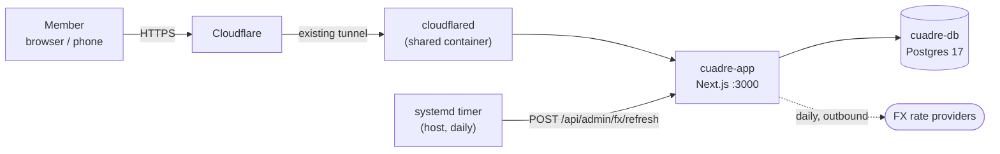

# Architecture

## System



No inbound ports are opened on the router. The app's hostname is added as a public hostname on an
existing Cloudflare Tunnel — `cloudflared` gets bridged onto the `cuadre_default` network and
routes to `http://cuadre-app:3000`. The public origin comes from `APP_URL`; nothing in the repo
hardcodes a domain.

The only scheduled work is the daily FX refresh, and it is triggered from outside the app rather
than by an in-process scheduler — see *Scheduled work* below.

## Internal boundary

One container, three worlds, separated by directory:

```
src/
  app/                    Next routes, React components, client state
    (auth)/               login, register
    g/[groupId]/          the group: expenses, balances, settle up
    api/                  Route Handlers — thin: validate, call service, serialize
  server/
    db/                   Drizzle schema + migrations
    services/             domain logic (groups, expenses, balances, settlements, fx)
    auth/                 JWT signing, session helpers, membership guards
    fx/                   rate providers + the refresh job
  lib/
    money/                pure money math — minor units, splits, balances, simplification
    i18n/                 message catalogs
```

**`src/app/` never imports Drizzle or touches the DB.** Route Handlers validate input with Zod
and delegate to `src/server/services/`. This is what lets FE and BE context stay separable.
See [ADR-0001](../adr/0001-nextjs-fullstack-monolith.md).

**`src/lib/money/` imports nothing.** No Drizzle, no Next, no config, no I/O. It is the one part
of this codebase where a bug silently produces wrong numbers instead of an error, so it is kept
pure specifically to make it exhaustively testable — property tests included. Services call into
it; it never calls back out. Everything it does is specified in
[splitting.md](splitting.md).

## Why Next.js full-stack

Reuses a deployment chain that already works on this box — CI → GHCR → a systemd pull timer —
rather than inventing a second one. One container, one image, one deploy.

The API surface is a plain JSON API under `/api`, and auth accepts a `Bearer` token as well as
the httpOnly cookie ([ADR-0003](../adr/0003-jwt-cookie-and-bearer.md)), so a native client later
is a client problem, not a rewrite. That was the one real argument for splitting the backend out,
and this closes it cheaply.

Unlike the sibling wishlist app, **nothing here needs to render as a link preview**, so
server-rendered OG tags are not an architectural driver. Server Components are still the default,
for latency and payload size, not for crawlers.

## Data flow: adding an expense

1. `POST /api/groups/:id/expenses` — authenticated, membership verified in the service
2. Zod parses the payload: amount as a **string** of minor units, currency, date, payers, splits
3. The service resolves the split strategy into concrete per-member minor-unit amounts via
   `src/lib/money/` — including deterministic remainder allocation
4. **The balance assertion runs before anything is written**: `sum(payers) == sum(splits) == total`
5. One transaction writes `expenses` + `expense_payers` + `expense_splits`
6. A database `CHECK`-backed constraint and a post-write assertion both hold; a violation aborts
   the transaction rather than storing an unbalanced expense

Balances are **never** written here. They are computed on read from the ledger — see below.

## Data flow: reading balances

```
expenses + expense_payers + expense_splits + settlements
    → net position per member, per currency
    → (if the group has a display currency) convert each leg at the group's pinned rate
    → (if simplify is on) run the settlement-plan reduction
    → payment plan
```

Every step after the first is a pure function of the one before it. Nothing in this chain is
persisted, which is what makes both toggles reversible by construction
([ADR-0006](../adr/0006-simplification-is-derived.md),
[ADR-0007](../adr/0007-reversible-display-currency.md)).

The cost is real but bounded: a group is 2–15 members and hundreds of expenses at most, so this
is a single indexed query plus arithmetic. **Don't add a cached balances table** without evidence
from a real group that the read is slow — a denormalized balance that can disagree with the
ledger is the bug this design exists to prevent.

## Scheduled work

One job: fetch FX rates once a day.

It is an **idempotent endpoint** (`POST /api/admin/fx/refresh`, bearer `FX_REFRESH_TOKEN`)
triggered by a systemd timer on the host, mirroring the deploy-timer idiom already running on
this machine. Not an in-process `setInterval`, which dies with the container and silently stops
being a schedule.

It also has a **lazy fallback**: if a conversion asks for a rate and today's is missing, the
service fetches on demand rather than failing. A missed timer must never block a member from
converting their group. Details in [currency.md](currency.md).

## Deployment

```
<deploy-dir>/
  docker-compose.yml
  .env                  # chmod 600, never in git
  data/
    postgres/
```

All services use `restart: unless-stopped` so the stack comes back on its own after a reboot.

**A dedicated Postgres container.** Don't reuse a Postgres instance belonging to another
self-hosted service — those are often extension-tuned with their own backup and upgrade cycles,
and sharing one couples two unrelated services in ways that complicate both.

## Operational notes

- **This data is not reconstructable, and that makes it different.** A wishlist item can be
  re-added from its URL; a trip's ledger cannot be re-derived from anything. The database is the
  only copy of who owes whom. Whoever operates this should back up
  `data/postgres/` — the app deliberately makes no attempt to be self-healing about it.
- **Outbound traffic is one FX call a day.** There is no scraping, no crawling, no per-request
  egress. If something in this app starts making outbound requests per user action, that is a
  design change worth an ADR.
- **Single instance only.** Migrations run at startup, which is safe with exactly one container
  and races with replicas. Scaling out means moving migrations to a release step first.

## Dependency policy

Adding a runtime dependency needs a line in the ADR or task explaining why. Current intended set:

`next` · `react` · `drizzle-orm` · `postgres` · `zod` · `jose` (JWT) · `@node-rs/argon2` ·
`nanoid` · `tailwindcss` · `@base-ui/react` · `@tanstack/react-query` ·
`react-hook-form` · `@hookform/resolvers`

**No money library.** Amounts are `bigint` minor units and the arithmetic in
[splitting.md](splitting.md) is addition, comparison, and one integer division with an explicit
remainder rule. `decimal.js` or `dinero.js` would add a dependency to avoid code that must be
read and tested line by line regardless. See
[ADR-0004](../adr/0004-money-as-integer-minor-units.md).

**No charting library yet.** It arrives with E9, in that task, with the choice made there against
real requirements rather than guessed at now.
